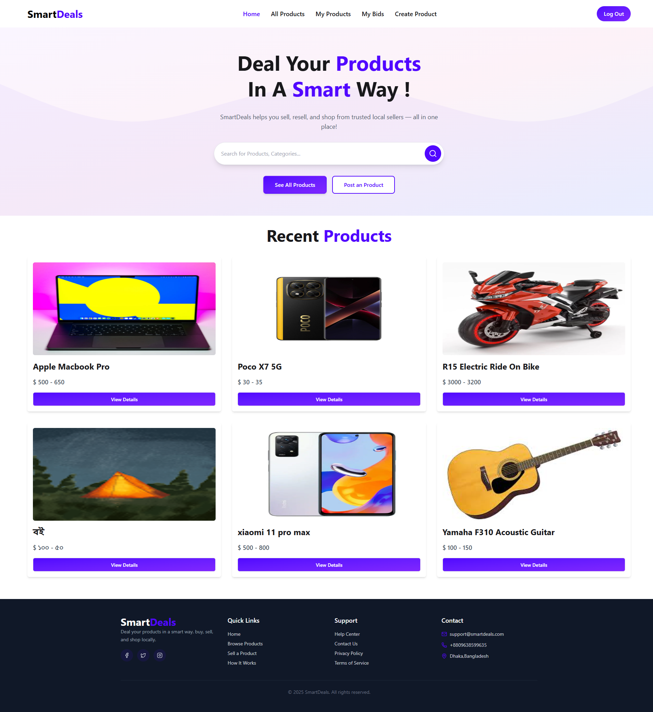
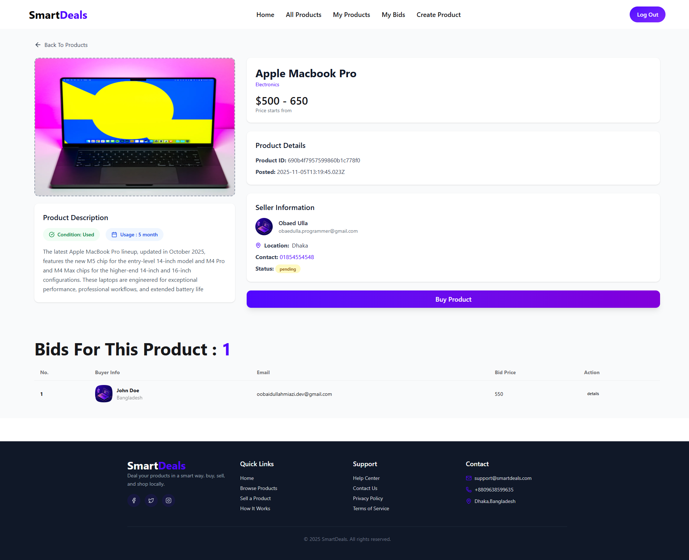
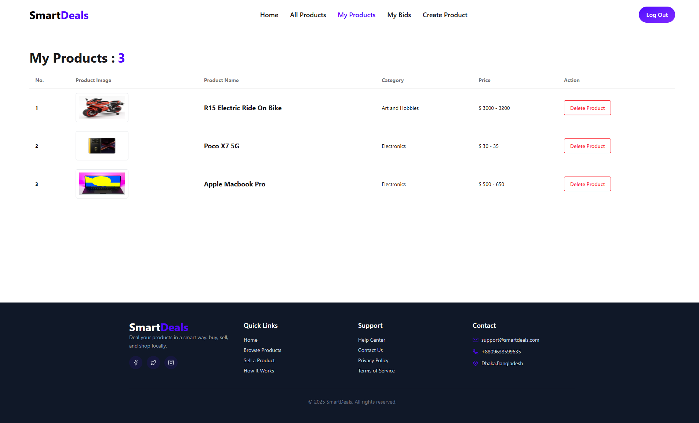

# 🛍️ Smart Deals Shop

A simple and user-friendly MERN stack web application where users can **view products**, **place bids**, **post products for sale**, and **manage their own listings**.  
This project helped me practice and explore **CRUD operations**, **authentication**, and **client-server communication**.

---

### 🌐 Live Website

https://smart-deals-shop.web.app/

### 💻 Client Repository

https://github.com/obaidullah-miazi-dev/Smart-Deals-Client

### 🔗 Server Repository

https://github.com/obaidullah-miazi-dev/smart-deals-DB-server

---

## ✨ Features

- ✅ **User Authentication** (Login / Signup)
- 💼 **View Products:** Any user can browse all available products.
- 🛒 **Place Bid:** Users can place bids on products.
- 📦 **Post Product for Sale:** Authenticated users can list products they want to sell.
- 🧾 **My Products:** Users can view and manage product listings they posted.
- 🎯 **My Bids:** Users can see all the bids they have made.
- 🔐 **Protected Routes** using JWT & Firebase Auth
- 📱 Fully **Responsive UI**

---

## 🧱 Technologies Used

### Frontend (Client)

| Tech                    | Purpose               |
| ----------------------- | --------------------- |
| React                   | Frontend UI framework |
| React Router DOM        | Page navigation       |
| Tailwind CSS            | UI styling            |
| Firebase Authentication | User login & signup   |

### Backend (Server)

| Tech       | Purpose                     |
| ---------- | --------------------------- |
| Node.js    | Backend runtime environment |
| Express.js | API creation                |
| MongoDB    | Database for storing data   |
| JWT        | Secure user authorization   |

---

## 🔄 CRUD Explored

This project demonstrates CRUD operations clearly:

| Action     | Description                                |
| ---------- | ------------------------------------------ |
| **Create** | User can post a product / place a bid      |
| **Read**   | User can view products and details         |
| **Update** | Users can modify their posted product info |
| **Delete** | User can remove their own posted product   |

---

## 📸 Screenshots

### 🏠 Home Page



### 📦 Product Details



### 📊 Dashboard



---

## ⚙️ How to Run This Project Locally

Follow the steps below to set up both the client and server of Smart Deals Shop on your local machine.

```bash
1️⃣ Clone Both Repositories
Client (Frontend)
git clone https://github.com/obaidullah-miazi-dev/Smart-Deals-Client

Server (Backend)
git clone https://github.com/obaidullah-miazi-dev/smart-deals-DB-server

2️⃣ Backend Setup (Node.js, Express, MongoDB, FirebaseToken)
1. Navigate to the backend folder
cd smart-deals-DB-server

2. Install dependencies
npm install

3. Create a .env file

Inside the backend folder, create a file named .env and add:

DB_USER=your_mongodb_username
DB_PASS=your_mongodb_password
ACCESS_TOKEN_SECRET=your_firebase_access_token_secret


(Use your own MongoDB Atlas credentials and firebase access token for the JWT secret.)

4. Start the backend server
node index.js


Backend should now be running at:

http://localhost:5000

3️⃣ Frontend Setup (React, Firebase Auth, Tailwind CSS)
1. Navigate to the client folder
cd ../Smart-Deals-Client

2. Install dependencies
npm install

3. Add Firebase configuration

Inside:

src/firebase/firebase.config.js


Add your Firebase project credentials:

export const firebaseConfig = {
  apiKey: "YOUR_API_KEY",
  authDomain: "YOUR_AUTH_DOMAIN",
  projectId: "YOUR_PROJECT_ID",
  storageBucket: "YOUR_STORAGE_BUCKET",
  messagingSenderId: "YOUR_SENDER_ID",
  appId: "YOUR_APP_ID",
};


(You can find these in your Firebase console.)

4. Start the frontend development server
npm run dev


The frontend will be available at:

http://localhost:5173

✔️ Local Setup Completed

Your project is now running locally:

Frontend: http://localhost:5173

Backend: http://localhost:5000
```

You can now test features such as product posting, bidding, authentication, and dashboard views.

📌 Author  

Obaidullah Miazi  

MERN Stack Developer  

Motivated to build useful digital products  


Email: obaidullahmiazi.dev@gmail.com

LinkedIn: https://www.linkedin.com/in/obaidullah-miazi

⭐ If you like this project, consider giving it a star on GitHub!
